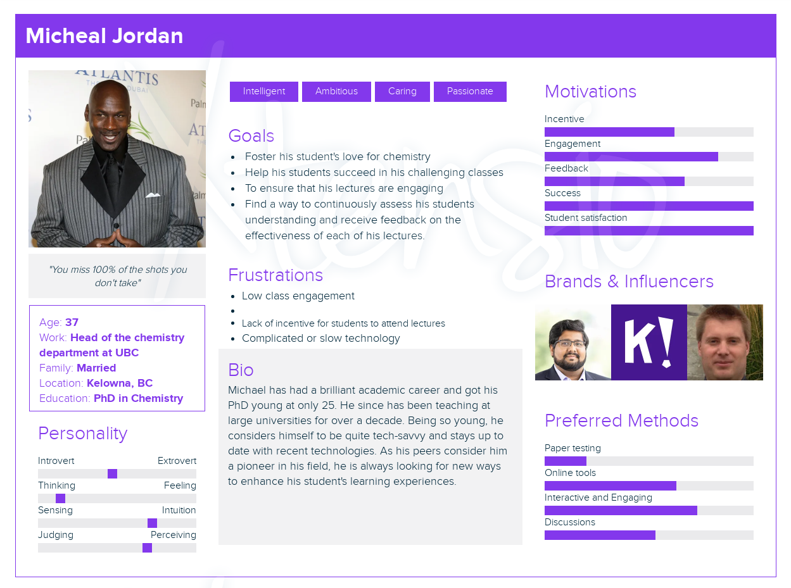

# Milestone #2 - Project Description and Requirements

## Description

The project our team is approaching is the iClicker clone.

The goal of this project is to develop a web-based platform that will allow instructors to perform real-time polling and receive instant feedback from students. This platform will evidently be modeled after the iClicker service but improve on some of its features to give instructors more flexibility in questions.

The platform will temporarily be referred to as EduPoll until the team comes up with a better name. EduPoll will only support multi-choice question as its goal is to enable fast,real-time, in-class asssessment to keep students engaged and test their knowledge. In order for instructors to be able to view student responses in real-time, the system will integrate the Behavioural Observer Pattern that defines a relationship between objects where a subject object maintains a list of its dependents observers. This will allow instructors to be notified automatically of any state changes when students answer.

Furthermore, EduPoll will be created using a microservice architecture, thus broken down into smaller, independent services interacting with each other using APIs. In order for the system to support a SOA architecture, it will incorporate the structural facade design pattern in order to provide a simplified interface between the users and the underlying system.

In order for students to feel compelled to interact without the fear of being wrong, student's usernames will only be viewable by the instructor to preserve anonymity.

## Requirements analysis and development

### Proto-persona for user

*please excuse the watermark

Name: Michael Jordan

Age: 37

Education: PhD in Chemistry

Family Status: Married

Job Title: Head of the chemistry department at UBC

Background: Michael has had a brilliant academic career and got his phD young at only 25. He since has been teaching at large universities for over a decade. Being so young, he considers himself a tech-savyy and stays up to date with recent technologies. As his peers consider him a pioneer in his field, he is always looking for new ways to enhance his student's learning experiences.

Goals: Professor Jordan's goal is to foster his student's love for chemistry and suceed in his classes. He wants to make sure the lectures are engaging and that his students are able to understand and apply the material they are learning. He has long been looking for a way to continuously assess students in class not for grades but for learning.

How will Michael Jordan interact with EduPoll: Michael would like the platform to be very customizable, he would like to be able to share his screen while starting his questions or upload a pre-set image to his questions so that his students can see the question on their screen. He would also like to be able to visualize his students answer in real-time as people are answering the poll. His ultimate goal is to identify student's gap of knowledge and adapt his lectures and cursus accordingly.

### Journey-line

Again this is not final and temporary. Mac if you can make all these steps into a nice journey line diagram please

1. Professor Jordan introduces the EduPoll platform to his students at the beginning of the year and explains how it will be used throughout the year as a continously graded assessment.
2. During lectures, he tries to fit at least 5 EduPoll questions to his students in the platform, always related to what they're currently studying and chronologically logical.
3. If all the students answer correctly, Michael distributes candies or chocolates in the class as an incentive for learning.
4. As the system keeps every student as an object, Michael does not have to manually increment each student's score.
5. After the lecture, he reviews the class polls and takes notes about what to review in his review sessions before each of his 3 midterms.
6. As the semester progresses, Michael notices that his students are becoming more engaged and motivated in class, thanks to EduPoll.
7. At the end of the semester, Professor Jordan is able to set an automatic message per grade range through the EduPoll system to congratulate/inform students of their grade.
8. Michael is pleased with the system and plans on using it for his other classes.

### Functional Requirements

- The system will allow instructors to create and customize polls and quizzes, incorporating multiple choice or single-choice questions.
- The system will allow instructors to either share their screens or have a pre-set written or image question.
- The system will notify instructors of student responses in real-time using the Observer design pattern.
- The system will provide reports and analytics on student performance and learning outcomes.
- The system will incorporate game elements to keep students engaged, such as a leaderboard with a top 10.
- The system will allow instructors to send a personalized message per grade-range to students.
- ?(The system should integrate with learning management systems like Canvas or Blackboard.) Not sure if this is realistic.
- The system will protect student data and ensure anonymity from other students.
- The system will allow students and instructors to create an account based on their respective roll.
- The system will allow student users to join a class.
- the system will allow instructors to create a class
- the system will allow studnet users to answer polls/quizes

### Non-functional Requirements

- The system should allow instructors to launch polls and quizzes quickly and easily during class. 
- The system should have instant-response time(less than 2s will do) for student's response.
- The system should be accessible from different browsers and devices.
- The system must not disclose any personal information about students and instructors apart from their name.
- The system should be scalable and open to future improvements, such as add short answer questions, matching questions or ranking quizzes.

